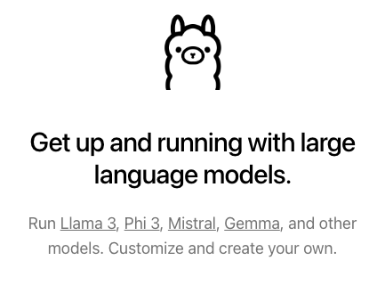
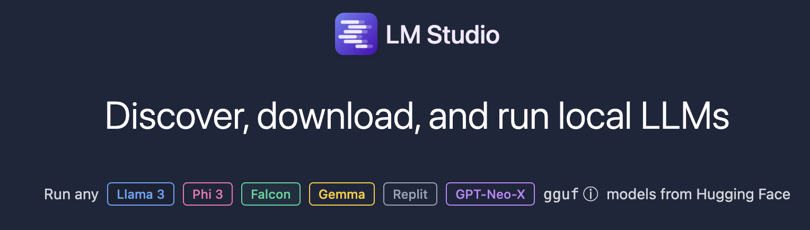
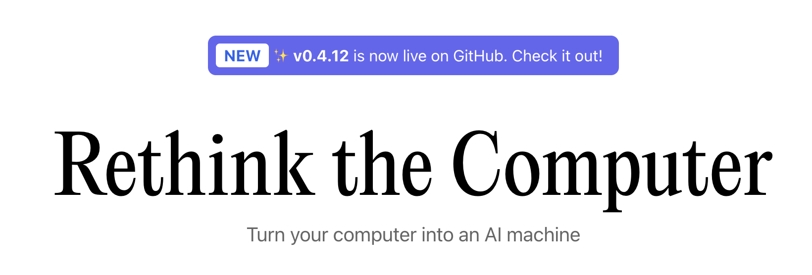

# Introducción a la IA Generativa

## 0. Definiciones

### 0.1 IA Generativa

La IA generativa es un término que abarca cualquier tipo de inteligencia artificial diseñada para generar contenido nuevo y original en diversos dominios, no solo texto. Esto incluye la generación de imágenes, música, videos, entre otros tipos de datos.

### 0.2 Modelos de lenguaje grande

Los modelos de lenguaje largo son un subconjunto de la IA generativa, específicamente centrados en la generación de texto.

### 0.3 Herramientas para gestionar modelos de lenguaje grande de forma local

Una forma de utilizar los modelos de lenguaje grande de forma local es mediante el uso de herramientas que permitan descargar y gestionar estos modelos. Existen una gran variedad de herramientas dependiendo del uso que se desea tener, entre las principales se encuentran las siguientes:

| No | Nombre | Descripción |
| -- | -- | -- |
| 1 | [GPT4ALL](https://gpt4all.io/index.html) | Es una herramienta para tener un chatBot libre ejecutandose de forma local sin necesidad de internet. Imagen 1 |
| 2 | [ollama](https://ollama.com/) | Es una herramienta que permite gestionar modelos de lenguaje largo de forma local, para interactuar con ellos y poder desarrollar aplicaciones que hagan uso de estos modelos, mediante un servidor y el uso de API REST. Imagen 2|
| 3 | [LM Studio](https://lmstudio.ai/) | Es una herrameinta que permite desacargar y ejecutar modelos de lenguaje grande de forma local, permite interactuar con ellos mediante un chatBot, además de montar un servidor basado en la API libre de [OpenAI](https://platform.openai.com/docs/api-reference). Imagen 3|
| 4 | [JAN](https://jan.ai/about) | Es una herramienta alternativa de código abierto para ejecuar ChatGPT de [OpenAI](https://platform.openai.com/docs/api-reference). Imagen 4|


Imagen 1: GTP4All


Imagen 2: ollama


Imagen 3: LM Studio


Imagen 4: JAN


# ollama

Este curso se basa en la documentación del repositorio de [ollama github](https://github.com/ollama/ollama), y para poder realizar las actividades se puede hacer de forma local, o utilizar entornos de desarrollo en la nube, como los que se listan a continuación:

| No. | Herramienta | Descripción |
| -- | -- | -- |
| 1 | [GitHub](https://github.com/) | Plataforma para el control de versiones y manejo de repositorios. |
| 2 | [GitPod](https://gitpod.io/) | Entorno de desarrollo que brinda 100 hrs de uso gratuitas al mes, permite crear entornos de trabajo personalizados basados en repositorios de GitHub, GitLab |


## 1. Instalación de ollama

Para realizar la instalación de ollama se debe descargar la versión que corresponda al sistema operativo que se utiliza (Linux, macOS y Windows), esto se hace en la página oficial de [ollama download](https://ollama.com/download) en Linux, macOS y Windows.

### 1.1 Instalación en GNU Linux

```bash
$curl -fsSL https://ollama.com/install.sh | sh
```

## 2. Puesta en marcha

Una vez que se descargo e instalo [ollama](https://ollama.com/) se puede iniciar y detener su ejecución para que no se ejecute en segundo plano.

Para iniciar el servidor se ejecuta el siguiente comando:

```bash
$ollama serve
```

* Nota: al ejeuctar el servidor este habilita un servicio en **http://localhost:11434**, al que se puede acceder de diferentes formas, como se vera posteriormente.

### 2.1 Ejemplo de ejecución del servidor cuando se usa solo la CPU

```bash
time=2024-04-30T15:06:53.323Z level=INFO source=images.go:817 msg="total blobs: 5"
time=2024-04-30T15:06:53.323Z level=INFO source=images.go:824 msg="total unused blobs removed: 0"
time=2024-04-30T15:06:53.324Z level=INFO source=routes.go:1143 msg="Listening on 127.0.0.1:11434 (version 0.1.32)"
time=2024-04-30T15:06:53.324Z level=INFO source=payload.go:28 msg="extracting embedded files" dir=/tmp/ollama523635885/runners
time=2024-04-30T15:06:56.217Z level=INFO source=payload.go:41 msg="Dynamic LLM libraries [cpu_avx cpu_avx2 cuda_v11 rocm_v60002 cpu]"
time=2024-04-30T15:06:56.217Z level=INFO source=gpu.go:121 msg="Detecting GPU type"
time=2024-04-30T15:06:56.217Z level=INFO source=gpu.go:268 msg="Searching for GPU management library libcudart.so*"
time=2024-04-30T15:06:56.218Z level=INFO source=gpu.go:314 msg="Discovered GPU libraries: [/tmp/ollama523635885/runners/cuda_v11/libcudart.so.11.0]"
time=2024-04-30T15:06:56.218Z level=INFO source=gpu.go:343 msg="Unable to load cudart CUDA management library /tmp/ollama523635885/runners/cuda_v11/libcudart.so.11.0: your nvidia driver is too old or missing, please upgrade to run ollama"
time=2024-04-30T15:06:56.219Z level=INFO source=gpu.go:268 msg="Searching for GPU management library libnvidia-ml.so"
time=2024-04-30T15:06:56.220Z level=INFO source=gpu.go:314 msg="Discovered GPU libraries: []"
time=2024-04-30T15:06:56.220Z level=INFO source=cpu_common.go:11 msg="CPU has AVX2"
time=2024-04-30T15:06:56.220Z level=INFO source=routes.go:1164 msg="no GPU detected"
```

### 2.2 Ejemplo de ejecución del servidor cuando se utiliza GPU

```bash
pendiente
```

### 2.3 Ejemplo de ejecución cuando recibe una petición

```json
{"function":"log_server_request","level":"INFO","line":2734,"method":"GET","msg":"request","params":{},"path":"/health","remote_addr":"127.0.0.1","remote_port":57132,"status":200,"tid":"140145076446784","timestamp":1714489663}
{"function":"process_single_task","level":"INFO","line":1506,"msg":"slot data","n_idle_slots":1,"n_processing_slots":0,"task_id":2,"tid":"140147531671424","timestamp":1714489663}
{"function":"log_server_request","level":"INFO","line":2734,"method":"GET","msg":"request","params":{},"path":"/health","remote_addr":"127.0.0.1","remote_port":57136,"status":200,"tid":"140145237952064","timestamp":1714489663}
{"function":"process_single_task","level":"INFO","line":1506,"msg":"slot data","n_idle_slots":1,"n_processing_slots":0,"task_id":3,"tid":"140147531671424","timestamp":1714489663}
{"function":"log_server_request","level":"INFO","line":2734,"method":"GET","msg":"request","params":{},"path":"/health","remote_addr":"127.0.0.1","remote_port":36780,"status":200,"tid":"140145271522880","timestamp":1714489663}
{"function":"process_single_task","level":"INFO","line":1506,"msg":"slot data","n_idle_slots":1,"n_processing_slots":0,"task_id":4,"tid":"140147531671424","timestamp":1714489663}
{"function":"log_server_request","level":"INFO","line":2734,"method":"GET","msg":"request","params":{},"path":"/health","remote_addr":"127.0.0.1","remote_port":36784,"status":200,"tid":"140145246344768","timestamp":1714489663}
{"function":"log_server_request","level":"INFO","line":2734,"method":"GET","msg":"request","params":{},"path":"/health","remote_addr":"127.0.0.1","remote_port":36788,"status":200,"tid":"140145263130176","timestamp":1714489663}
{"function":"process_single_task","level":"INFO","line":1506,"msg":"slot data","n_idle_slots":1,"n_processing_slots":0,"task_id":5,"tid":"140147531671424","timestamp":1714489663}
{"function":"log_server_request","level":"INFO","line":2734,"method":"GET","msg":"request","params":{},"path":"/health","remote_addr":"127.0.0.1","remote_port":36788,"status":200,"tid":"140145263130176","timestamp":1714489663}
{"function":"launch_slot_with_data","level":"INFO","line":830,"msg":"slot is processing task","slot_id":0,"task_id":6,"tid":"140147531671424","timestamp":1714489663}
{"function":"update_slots","ga_i":0,"level":"INFO","line":1809,"msg":"slot progression","n_past":0,"n_past_se":0,"n_prompt_tokens_processed":18,"slot_id":0,"task_id":6,"tid":"140147531671424","timestamp":1714489663}
{"function":"update_slots","level":"INFO","line":1836,"msg":"kv cache rm [p0, end)","p0":0,"slot_id":0,"task_id":6,"tid":"140147531671424","timestamp":1714489663}
{"function":"print_timings","level":"INFO","line":269,"msg":"prompt eval time     =    1442.30 ms /    18 tokens (   80.13 ms per token,    12.48 tokens per second)","n_prompt_tokens_processed":18,"n_tokens_second":12.480092519085876,"slot_id":0,"t_prompt_processing":1442.297,"t_token":80.12761111111111,"task_id":6,"tid":"140147531671424","timestamp":1714489668}
{"function":"print_timings","level":"INFO","line":283,"msg":"generation eval time =    3389.28 ms /    22 runs   (  154.06 ms per token,     6.49 tokens per second)","n_decoded":22,"n_tokens_second":6.491046486514556,"slot_id":0,"t_token":154.05836363636365,"t_token_generation":3389.284,"task_id":6,"tid":"140147531671424","timestamp":1714489668}
{"function":"print_timings","level":"INFO","line":293,"msg":"          total time =    4831.58 ms","slot_id":0,"t_prompt_processing":1442.297,"t_token_generation":3389.284,"t_total":4831.581,"task_id":6,"tid":"140147531671424","timestamp":1714489668}
{"function":"update_slots","level":"INFO","line":1640,"msg":"slot released","n_cache_tokens":40,"n_ctx":2048,"n_past":39,"n_system_tokens":0,"slot_id":0,"task_id":6,"tid":"140147531671424","timestamp":1714489668,"truncated":false}
{"function":"log_server_request","level":"INFO","line":2734,"method":"POST","msg":"request","params":{},"path":"/completion","remote_addr":"127.0.0.1","remote_port":36788,"status":200,"tid":"140145263130176","timestamp":1714489668}
{"function":"process_single_task","level":"INFO","line":1506,"msg":"slot data","n_idle_slots":1,"n_processing_slots":0,"task_id":31,"tid":"140147531671424","timestamp":1714489668}
{"function":"log_server_request","level":"INFO","line":2734,"method":"GET","msg":"request","params":{},"path":"/health","remote_addr":"127.0.0.1","remote_port":36802,"status":200,"tid":"140145254737472","timestamp":1714489668}
{"function":"log_server_request","level":"INFO","line":2734,"method":"POST","msg":"request","params":{},"path":"/tokenize","remote_addr":"127.0.0.1","remote_port":36802,"status":200,"tid":"140145254737472","timestamp":1714489668}
[GIN] 2024/04/30 - 15:07:48 | 200 |  7.046967594s |       127.0.0.1 | POST     "/api/generate"
```

## 3. Lista de modelos disponibles

En la seccion de modelos de [ollama](https://ollama.com/), hay una lista de [modelos](https://ollama.com/library) disponibles para utilizarse, cada modelo tiene una descripción y diferentes versiones (tags) disponibles, estas versiones varian en tamaño, uso, idiomas, y capacidad de responder preguntas.

| Model              | Parameters | Size  | Download                       |
| ------------------ | ---------- | ----- | ------------------------------ |
| Llama 2            | 7B         | 3.8GB | `ollama run llama2:7b`            |
| Mistral            | 7B         | 4.1GB | `ollama run mistral:7b`           |
| Dolphin Phi        | 2.7B       | 1.6GB | `ollama run dolphin-phi`       |
| Phi-2              | 2.7B       | 1.7GB | `ollama run phi`               |
| Neural Chat        | 7B         | 4.1GB | `ollama run neural-chat`       |
| Starling           | 7B         | 4.1GB | `ollama run starling-lm`       |
| Code Llama         | 7B         | 3.8GB | `ollama run codellama`         |
| Llama 2 Uncensored | 7B         | 3.8GB | `ollama run llama2-uncensored` |
| Llama 2 13B        | 13B        | 7.3GB | `ollama run llama2:13b`        |
| Llama 2 70B        | 70B        | 39GB  | `ollama run llama2:70b`        |
| Orca Mini          | 3B         | 1.9GB | `ollama run orca-mini`         |
| Vicuna             | 7B         | 3.8GB | `ollama run vicuna`            |
| LLaVA              | 7B         | 4.5GB | `ollama run llava`             |
| Gemma              | 2B         | 1.4GB | `ollama run gemma:2b`          |
| Gemma              | 7B         | 4.8GB | `ollama run gemma:7b`          |
| Solar              | 10.7B      | 6.1GB | `ollama run solar`             |

## 4. Descargar modelos

Antes de iniciar hay que descargar un modelo para comenzar a interactuar como el, para este proceso se ejeucta el siguiente comando:

```bash
$ollama pull gemma:2b
```

Ejemplo de desacarga del modelo gemma:2b

```bash
pulling manifest 
pulling c1864a5eb193... 100% ▕█████████████████████████████████████████████████████████████████████▏ 1.7 GB                         
pulling 097a36493f71... 100% ▕█████████████████████████████████████████████████████████████████████▏ 8.4 KB                         
pulling 109037bec39c... 100% ▕█████████████████████████████████████████████████████████████████████▏  136 B                         
pulling 22a838ceb7fb... 100% ▕█████████████████████████████████████████████████████████████████████▏   84 B                         
pulling 887433b89a90... 100% ▕█████████████████████████████████████████████████████████████████████▏  483 B                         
verifying sha256 digest 
writing manifest 
removing any unused layers 
success 
```

## 5. Ver modelos descagados

Una vez que se descargan los modelos es posible ver los modelos que estan en el servidor local para poder utilzarlos.

```bash
$ollama list
```

### 5.1 Ejemplo de lista de modelos

| NAME | ID | SIZE | MODIFIED |
| -- | -- | -- | -- |
| gemma:2b | b50d6c999e59 | 1.7 GB | 41 seconds ago |

## 6. Ejecutar modelo

Con los modelos descagados localmente es posible interactuar con ellos de varias formas, como se muestra a continuación:

### 6.1 Modo de consulta en terminal

En el modo de consulta se realiza una llamada al modelo y se anexa una pregunta, este generará una respuesta y la imprimira en consola.

```bash
$ollama run gemma:2b ¿porqué el cielo es azúl?
```

Ejemplo de salida

```bash
El cielo no es azúl. El cielo es azul porque las longitudes de onda del azul son más largas que las longitudes de onda del rojo. Esto significa que la luz azul está menos dispersada en el aire, lo que significa que está más estable y aparece azul.
```

### 6.2 Modo interactivo en terminal

```bash
$ollama run gemma:2b
```

Ejemplo de salida

```bash
>>> ¿porqué el cielo es azúl?
El cielo no es azúl. El cielo es azul debido a que la luz solar atrae las longitudes de onda más cortas en la atmósfera, como el azul y el verde.

>>> Send a message (/? for help)
```

* Nota: Para salir del modo interactivo se utliza la combinación de teclas **Ctrl + d**.

### 6.3 Mediante consulta de la API REST con [curl](https://curl.se) sin parámetros (Generación de respuesta)

Consulta simple sin parámetros:

```bash
curl http://localhost:11434/api/generate -d '{
  "model": "gemma:2b",
  "prompt":"¿porqué el cielo es azúl?"
}'
```

Ejemplo de salida

```json
{"model":"gemma:2b","created_at":"2024-04-30T15:18:52.51818509Z","response":"El","done":false}
{"model":"gemma:2b","created_at":"2024-04-30T15:18:52.695474933Z","response":" cielo","done":false}
{"model":"gemma:2b","created_at":"2024-04-30T15:18:52.798268348Z","response":" no","done":false}
{"model":"gemma:2b","created_at":"2024-04-30T15:18:52.907026682Z","response":" es","done":false}
{"model":"gemma:2b","created_at":"2024-04-30T15:18:53.019430275Z","response":" az","done":false}
{"model":"gemma:2b","created_at":"2024-04-30T15:18:53.196500878Z","response":"úl","done":false}
{"model":"gemma:2b","created_at":"2024-04-30T15:18:53.298319953Z","response":".","done":false}
{"model":"gemma:2b","created_at":"2024-04-30T15:18:53.400066568Z","response":" El","done":false}
{"model":"gemma:2b","created_at":"2024-04-30T15:18:53.501729123Z","response":" cielo","done":false}
{"model":"gemma:2b","created_at":"2024-04-30T15:18:53.620523445Z","response":" es","done":false}
{"model":"gemma:2b","created_at":"2024-04-30T15:18:53.807266717Z","response":" azul","done":false}
{"model":"gemma:2b","created_at":"2024-04-30T15:18:53.92047312Z","response":" porque","done":false}
{"model":"gemma:2b","created_at":"2024-04-30T15:18:54.106861762Z","response":" contiene","done":false}
{"model":"gemma:2b","created_at":"2024-04-30T15:18:54.225510424Z","response":" más","done":false}
{"model":"gemma:2b","created_at":"2024-04-30T15:18:54.408772977Z","response":" azul","done":false}
{"model":"gemma:2b","created_at":"2024-04-30T15:18:54.52286666Z","response":" que","done":false}
{"model":"gemma:2b","created_at":"2024-04-30T15:18:54.695894974Z","response":" cualquier","done":false}
{"model":"gemma:2b","created_at":"2024-04-30T15:18:54.815171036Z","response":" otro","done":false}
{"model":"gemma:2b","created_at":"2024-04-30T15:18:54.996691939Z","response":" color","done":false}
{"model":"gemma:2b","created_at":"2024-04-30T15:18:55.117217561Z","response":" del","done":false}
{"model":"gemma:2b","created_at":"2024-04-30T15:18:55.311956601Z","response":" espectro","done":false}
{"model":"gemma:2b","created_at":"2024-04-30T15:18:55.513452331Z","response":" visible","done":false}
{"model":"gemma:2b","created_at":"2024-04-30T15:18:55.71979871Z","response":".","done":false}
{"model":"gemma:2b","created_at":"2024-04-30T15:18:55.909744051Z","response":"","done":true,"context":[106,1645,108,235737,1276,14419,822,34327,875,4722,27026,235336,107,108,106,2516,108,3275,34327,793,875,4722,27026,235265,2810,34327,875,13788,10755,37550,3267,13788,907,16377,14207,2881,1177,198706,12918,235265,107,108],"total_duration":6576316703,"load_duration":1781189742,"prompt_eval_count":18,"prompt_eval_duration":1362568000,"eval_count":24,"eval_duration":3391382000}
```

### 6.4 Mediante consulta de la API REST con [curl](https://curl.se) con parámetros (Generación de respuesta)

Consulta utilizando el parámetro stream

```bash
curl http://localhost:11434/api/generate -d '{
  "model": "gemma:2b",
  "prompt":"¿porqué el cielo es azúl?",
  "stream" : false
}'
```

Como se puede ver en la salida, el resultado no se va mostrando palabra por palabra, sólo se muestra el resultado final.

Ejemplo de salida:

```json
{"model":"gemma:2b","created_at":"2024-04-30T15:24:38.823431957Z","response":"El cielo no es azúl. El cielo es azul debido al efecto de Rayleigh. El efecto Rayleigh es una propiedad de la luz que establece que la luz más corta (como el azul) se dispersa más fácilmente por un medio que tiene un tamaño comparable al de las partículas del medio. El cielo está formado por el azul del universo, que es una mezcla de diferentes longitudes de onda de luz.","done":true,"context":[106,1645,108,235737,1276,14419,822,34327,875,4722,27026,235336,107,108,106,2516,108,3275,34327,793,875,4722,27026,235265,2810,34327,875,13788,34355,717,41064,581,153902,235265,2810,41064,153902,875,1749,43182,581,683,16601,907,99334,907,683,16601,3267,46326,591,14197,822,13788,235275,699,58989,235250,3267,69360,1395,748,15716,907,8819,748,33064,28477,717,581,1778,152737,1177,15716,235265,2810,34327,5365,104099,1395,822,13788,1177,68905,235269,907,875,1749,59619,581,17340,29717,484,581,73227,581,16601,235265,107,108],"total_duration":7129292361,"load_duration":2006890139,"prompt_eval_count":18,"prompt_eval_duration":575924000,"eval_count":82,"eval_duration":4499467000}
```

Elementos que contiene la respuesta

- **model:** Módelo utilizado
- **total_duration:** Tiempo dedicado a generar la respuesta.
- **load_duration:** Tiempo dedicado en nanosegundos a cargar el modelo.
- **prompt_eval_count:** Número de tokens en el estímulo o indicación.
- **prompt_eval_duration:** Tiempo dedicado en nanosegundos a evaluar el estímulo o indicación.
- **eval_count:** Número de tokens en la respuesta.
- **eval_duration:** Tiempo en nanosegundos dedicado a generar la respuesta.
- **context:** Una codificación de la conversación utilizada en esta respuesta, esto puede ser enviado en la siguiente solicitud para mantener una memoria conversacional.
- **response:** Vacío si la respuesta fue transmitida en tiempo real, si no fue transmitida en tiempo real, esto contendrá la respuesta completa.

### 6.5 Mediante consulta de la API REST con [curl](https://curl.se) sin parámetros (Modo Chat)

Consulta simple sin parámetros:

```shell
curl http://localhost:11434/api/chat -d '{
  "model": "gemma:2b",
  "messages": [
    { 
        "role": "user", 
        "content": "¿porqué el cielo es azúl?" 
    }
  ]
}'
```

Ejemplo de salida

```json
{"model":"gemma:2b","created_at":"2024-04-30T15:29:05.42156699Z","message":{"role":"assistant","content":"El"},"done":false}
{"model":"gemma:2b","created_at":"2024-04-30T15:29:05.622209069Z","message":{"role":"assistant","content":" cielo"},"done":false}
{"model":"gemma:2b","created_at":"2024-04-30T15:29:05.913998916Z","message":{"role":"assistant","content":" no"},"done":false}
{"model":"gemma:2b","created_at":"2024-04-30T15:29:06.294631829Z","message":{"role":"assistant","content":" es"},"done":false}
{"model":"gemma:2b","created_at":"2024-04-30T15:29:06.412776811Z","message":{"role":"assistant","content":" az"},"done":false}
{"model":"gemma:2b","created_at":"2024-04-30T15:29:06.528744984Z","message":{"role":"assistant","content":"úl"},"done":false}
{"model":"gemma:2b","created_at":"2024-04-30T15:29:06.708626937Z","message":{"role":"assistant","content":"."},"done":false}
{"model":"gemma:2b","created_at":"2024-04-30T15:29:06.894168579Z","message":{"role":"assistant","content":" El"},"done":false}
{"model":"gemma:2b","created_at":"2024-04-30T15:29:07.010996671Z","message":{"role":"assistant","content":" cielo"},"done":false}
{"model":"gemma:2b","created_at":"2024-04-30T15:29:07.121965715Z","message":{"role":"assistant","content":" es"},"done":false}
{"model":"gemma:2b","created_at":"2024-04-30T15:29:07.299675718Z","message":{"role":"assistant","content":" un"},"done":false}
{"model":"gemma:2b","created_at":"2024-04-30T15:29:07.429267309Z","message":{"role":"assistant","content":" color"},"done":false}
{"model":"gemma:2b","created_at":"2024-04-30T15:29:07.607947782Z","message":{"role":"assistant","content":" negro"},"done":false}
{"model":"gemma:2b","created_at":"2024-04-30T15:29:07.721824475Z","message":{"role":"assistant","content":" y"},"done":false}
{"model":"gemma:2b","created_at":"2024-04-30T15:29:07.899275938Z","message":{"role":"assistant","content":" azul"},"done":false}
{"model":"gemma:2b","created_at":"2024-04-30T15:29:08.013422521Z","message":{"role":"assistant","content":" debido"},"done":false}
{"model":"gemma:2b","created_at":"2024-04-30T15:29:08.194411494Z","message":{"role":"assistant","content":" al"},"done":false}
{"model":"gemma:2b","created_at":"2024-04-30T15:29:08.311352126Z","message":{"role":"assistant","content":" re"},"done":false}
{"model":"gemma:2b","created_at":"2024-04-30T15:29:08.506407367Z","message":{"role":"assistant","content":"frac"},"done":false}
{"model":"gemma:2b","created_at":"2024-04-30T15:29:08.629716209Z","message":{"role":"assistant","content":"ción"},"done":false}
{"model":"gemma:2b","created_at":"2024-04-30T15:29:08.901192158Z","message":{"role":"assistant","content":" y"},"done":false}
{"model":"gemma:2b","created_at":"2024-04-30T15:29:09.017438371Z","message":{"role":"assistant","content":" la"},"done":false}
{"model":"gemma:2b","created_at":"2024-04-30T15:29:09.206972862Z","message":{"role":"assistant","content":" absorción"},"done":false}
{"model":"gemma:2b","created_at":"2024-04-30T15:29:09.399381534Z","message":{"role":"assistant","content":" de"},"done":false}
{"model":"gemma:2b","created_at":"2024-04-30T15:29:09.515039496Z","message":{"role":"assistant","content":" la"},"done":false}
{"model":"gemma:2b","created_at":"2024-04-30T15:29:09.696289069Z","message":{"role":"assistant","content":" luz"},"done":false}
{"model":"gemma:2b","created_at":"2024-04-30T15:29:09.82081905Z","message":{"role":"assistant","content":" solar"},"done":false}
{"model":"gemma:2b","created_at":"2024-04-30T15:29:10.011480392Z","message":{"role":"assistant","content":" por"},"done":false}
{"model":"gemma:2b","created_at":"2024-04-30T15:29:10.194901744Z","message":{"role":"assistant","content":" las"},"done":false}
{"model":"gemma:2b","created_at":"2024-04-30T15:29:10.308155347Z","message":{"role":"assistant","content":" moléculas"},"done":false}
{"model":"gemma:2b","created_at":"2024-04-30T15:29:10.494352649Z","message":{"role":"assistant","content":" del"},"done":false}
{"model":"gemma:2b","created_at":"2024-04-30T15:29:10.617334751Z","message":{"role":"assistant","content":" aire"},"done":false}
{"model":"gemma:2b","created_at":"2024-04-30T15:29:10.795765214Z","message":{"role":"assistant","content":" y"},"done":false}
{"model":"gemma:2b","created_at":"2024-04-30T15:29:10.995529414Z","message":{"role":"assistant","content":" el"},"done":false}
{"model":"gemma:2b","created_at":"2024-04-30T15:29:11.197993284Z","message":{"role":"assistant","content":" espacio"},"done":false}
{"model":"gemma:2b","created_at":"2024-04-30T15:29:11.313081816Z","message":{"role":"assistant","content":" interes"},"done":false}
{"model":"gemma:2b","created_at":"2024-04-30T15:29:11.506970428Z","message":{"role":"assistant","content":"telar"},"done":false}
{"model":"gemma:2b","created_at":"2024-04-30T15:29:11.620706891Z","message":{"role":"assistant","content":"."},"done":false}
{"model":"gemma:2b","created_at":"2024-04-30T15:29:11.898162059Z","message":{"role":"assistant","content":""},"done":true,"total_duration":6877077389,"load_duration":1313820,"prompt_eval_duration":269637000,"eval_count":39,"eval_duration":6476435000}
```

### 6.6 Mediante consulta de la API REST con [curl](https://curl.se) con parámetros (Modo Chat)

Consulta simple sin parámetros:

```bash
curl http://localhost:11434/api/chat -d '{
  "model": "gemma:2b",
  "messages": [
    { 
        "role": "user", 
        "content": "¿porqué el cielo es azúl?" 
    }
  ],
  "stream": false
}'
```

Ejemplo de salida

```json
{"model":"gemma:2b","created_at":"2024-04-30T15:30:11.27210018Z","message":{"role":"assistant","content":"El cielo no es azúl. El cielo es un color azul debido a la refracción y la dispersión de la luz solar en los gases del espacio interestelar."},"done":true,"total_duration":2582132933,"load_duration":1024500,"prompt_eval_duration":117876000,"eval_count":35,"eval_duration":2321719000}
```

#### Parámetros que contiene la entrada

- **model:** (obligatorio) el nombre del modelo.
- **messages:** los mensajes del chat, esto puede ser utilizado para mantener una memoria del chat.

El objeto de mensaje tiene los siguientes campos:

- **role:** el rol del mensaje, ya sea sistema, usuario o asistente.
- **content:** el contenido del mensaje.
- **images** (opcional): una lista de imágenes para incluir en el mensaje (para modelos multimodales como llava).

Parámetros avanzados (opcional):

- **format:** el formato para devolver una respuesta. Actualmente, el único valor aceptado es JSON.
- **options:** parámetros adicionales del modelo listados en la [documentación](https://github.com/ollama/ollama/blob/main/docs/modelfile.md#valid-parameters-and-values) para el archivo de modelo, como temperatura.
- **stream:** si es falso, la respuesta se devolverá como un único objeto de respuesta, en lugar de un flujo de objetos.
- **keep_alive:** controla cuánto tiempo el modelo permanecerá cargado en la memoria después de la solicitud (por defecto: 5 minutos).


### Enviar una entrada con historial en modo Chat

```shell
curl http://localhost:11434/api/chat -d '{
  "model": "gemma:2b",
  "messages": [
    {
      "role": "user",
      "content": "2 + 2"
    },
    {
      "role": "assistant",
      "content": "the answer is 4"
    },
    {
      "role": "user",
      "content": "3 * 3"
    },
    {
      "role": "assistant",
      "content": "the answer is 9"
    },
    {
      "role": "user",
      "content": "10 / 2"
    }
  ],
  "stream":false
}'
```

De esta forma es posible generar un historial con las respuestas para complementar las salidas que se van a obtener, otro uso es el de indicar el formado de salida que se espera

```json
{"model":"gemma:2b","created_at":"2024-04-30T17:48:43.61142888Z","message":{"role":"assistant","content":"The answer is 5\nThe answer is the result of dividing 10 by 2."},"done":true,"total_duration":1115917931,"load_duration":876100,"prompt_eval_duration":41514000,"eval_count":21,"eval_duration":853008000}
```


### 6.7 Mediante consulta de la API REST con [curl](https://curl.se) enviando una imagen en codificada [Base64](https://developer.mozilla.org/es/docs/Glossary/Base64)

Para envair archivos, en este caso imagenes se deben codificar a Base64, esto se puede hacer desde una terminal de linux de la siguiente forma:

#### Codificar  imagen a [Base64](https://developer.mozilla.org/es/docs/Glossary/Base64)


```bash
$base64 imagen1.jpg > imagen1.txt
```

Ejemplo de resultado:

```base64
iVBORw0KGgoAAAANSUhEUgAAAG0AAABmCAYAAADBPx+VAAAACXBIWXMAAAsTAAALEwEAmpwYAAAAAXNSR0IArs4c6QAAAARnQU1BAACxjwv8YQUAAA3VSURBVHgB7Z27r0zdG8fX743i1bi1ikMoFMQloXRpKFFIqI7LH4BEQ+NWIkjQuSWCRIEoULk0gsK1kCBI0IhrQVT7tz/7zZo888yz1r7MnDl7z5xvsjkzs2fP3uu71nNfa7lkAsm7d++Sffv2JbNmzUqcc8m0adOSzZs3Z+/XES4ZckAWJEGWPiCxjsQNLWmQsWjRIpMseaxcuTKpG/7HP27I8P79e7dq1ars/yL4/v27S0ejqwv+cUOGEGGpKHR37tzJCEpHV9tnT58+dXXCJDdECBE2Ojrqjh071hpNECjx4cMHVycM1Uhbv359B2F79+51586daxN/+pyRkRFXKyRDAqxEp4yMlDDzXG1NPnnyJKkThoK0VFd1ELZu3TrzXKxKfW7dMBQ6bcuWLW2v0VlHjx41z717927ba22U9APcw7Nnz1oGEPeL3m3p2mTAYYnFmMOMXybPPXv2bNIPpFZr1NHn4HMw0KRBjg9NuRw95s8PEcz/6DZELQd/09C9QGq5RsmSRybqkwHGjh07OsJSsYYm3ijPpyHzoiacg35MLdDSIS/O1yM778jOTwYUkKNHWUzUWaOsylE00MyI0fcnOwIdjvtNdW/HZwNLGg+sR1kMepSNJXmIwxBZiG8tDTpEZzKg0GItNsosY8USkxDhD0Rinuiko2gfL/RbiD2LZAjU9zKQJj8RDR0vJBR1/Phx9+PHj9Z7REF4nTZkxzX4LCXHrV271qXkBAPGfP/atWvu/PnzHe4C97F48eIsRLZ9+3a3f/9+87dwP1JxaF7/3r17ba+5l4EcaVo0lj3SBq5kGTJSQmLWMjgYNei2GPT1MuMqGTDEFHzeQSP2wi/jGnkmPJ/nhccs44jvDAxpVcxnq0F6eT8h4ni/iIWpR5lPyA6ETkNXoSukvpJAD3AsXLiwpZs49+fPn5ke4j10TqYvegSfn0OnafC+Tv9ooA/JPkgQysqQNBzagXY55nO/oa1F7qvIPWkRL12WRpMWUvpVDYmxAPehxWSe8ZEXL20sadYIozfmNch4QJPAfeJgW3rNsnzphBKNJM2KKODo1rVOMRYik5ETy3ix4qWNI81qAAirizgMIc+yhTytx0JWZuNI03qsrgWlGtwjoS9XwgUhWGyhUaRZZQNNIEwCiXD16tXcAHUs79co0vSD8rrJCIW98pzvxpAWyyo3HYwqS0+H0BjStClcZJT5coMm6D2LOF8TolGJtK9fvyZpyiC5ePFi9nc/oJU4eiEP0jVoAnHa9wyJycITMP78+eMeP37sXrx44d6+fdt6f82aNdkx1pg9e3Zb5W+RSRE+n+VjksQWifvVaTKFhn5O8my63K8Qabdv33b379/PiAP//vuvW7BggZszZ072/+TJk91YgkafPn166zXB1rQHFvouAWHq9z3SEevSUerqCn2/dDCeta2jxYbr69evk4MHDyY7d+7MjhMnTiTPnz9Pfv/+nfQT2ggpO2dMF8cghuoM7Ygj5iWCqRlGFml0QC/ftGmTmzt3rmsaKDsgBSPh0/8yPeLLBihLkOKJc0jp8H8vUzcxIA1k6QJ/c78tWEyj5P3o4u9+jywNPdJi5rAH9x0KHcl4Hg570eQp3+vHXGyrmEeigzQsQsjavXt38ujRo44LQuDDhw+TW7duRS1HGgMxhNXHgflaNTOsHyKvHK5Ijo2jbFjJBQK9YwFd6RVMzfgRBmEfP37suBBm/p49e1qjEP2mwTViNRo0VJWH1deMXcNK08uUjVUu7s/zRaL+oLNxz1bpANco4npUgX4G2eFbpDFyQoQxojBCpEGSytmOH8qrH5Q9vuzD6ofQylkCUmh8DBAr+q8JCyVNtWQIidKQE9wNtLSQnS4jDSsxNHogzFuQBw4cyM61UKVsjfr3ooBkPSqqQHesUPWVtzi9/vQi1T+rJj7WiTz4Pt/l3LxUkr5P2VYZaZ4URpsE+st/dujQoaBBYokbrz/8TJNQYLSonrPS9kUaSkPeZyj1AWSj+d+VBoy1pIWVNed8P0Ll/ee5HdGRhrHhR5GGN0r4LGZBaj8oFDJitBTJzIZgFcmU0Y8ytWMZMzJOaXUSrUs5RxKnrxmbb5YXO9VGUhtpXldhEUogFr3IzIsvlpmdosVcGVGXFWp2oU9kLFL3dEkSz6NHEY1sjSRdIuDFWEhd8KxFqsRi1uM/nz9/zpxnwlESONdg6dKlbsaMGS4EHFHtjFIDHwKOo46l4TxSuxgDzi+rE2jg+BaFruOX4HXa0Nnf1lwAPufZeF8/r6zD97WK2qFnGjBxTw5qNGPxT+5T/r7/7RawFC3j4vTp09koCxkeHjqbHJqArmH5UrFKKksnxrK7FuRIs8STfBZv+luugXZ2pR/pP9Ois4z+TiMzUUkUjD0iEi1fzX8GmXyuxUBRcaUfykV0YZnlJGKQpOiGB76x5GeWkWWJc3mOrK6S7xdND+W5N6XyaRgtWJFe13GkaZnKOsYqGdOVVVbGupsyA/l7emTLHi7vwTdirNEt0qxnzAvBFcnQF16xh/TMpUuXHDowhlA9vQVraQhkudRdzOnK+04ZSP3DUhVSP61YsaLtd/ks7ZgtPcXqPqEafHkdqa84X6aCeL7YWlv6edGFHb+ZFICPlljHhg0bKuk0CSvVznWsotRu433alNdFrqG45ejoaPCaUkWERpLXjzFL2Rpllp7PJU2a/v7Ab8N05/9t27Z16KUqoFGsxnI9EosS2niSYg9SpU6B4JgTrvVW1flt1sT+0ADIJU2maXzcUTraGCRaL1Wp9rUMk16PMom8QhruxzvZIegJjFU7LLCePfS8uaQdPny4jTTL0dbee5mYokQsXTIWNY46kuMbnt8Kmec+LGWtOVIl9cT1rCB0V8WqkjAsRwta93TbwNYoGKsUSChN44lgBNCoHLHzquYKrU6qZ8lolCIN0Rh6cP0Q3U6I6IXILYOQI513hJaSKAorFpuHXJNfVlpRtmYBk1Su1obZr5dnKAO+L10Hrj3WZW+E3qh6IszE37F6EB+68mGpvKm4eb9bFrlzrok7fvr0Kfv727dvWRmdVTJHw0qiiCUSZ6wCK+7XL/AcsgNyL74DQQ730sv78Su7+t/A36MdY0sW5o40ahslXr58aZ5HtZB8GH64m9EmMZ7FpYw4T6QnrZfgenrhFxaSiSGXtPnz57e9TkNZLvTjeqhr734CNtrK41L40sUQckmj1lGKQ0rC37x544r8eNXRpnVE3ZZY7zXo8NomiO0ZUCj2uHz58rbXoZ6gc0uA+F6ZeKS/jhRDUq8MKrTho9fEkihMmhxtBI1DxKFY9XLpVcSkfoi8JGnToZO5sU5aiDQIW716ddt7ZLYtMQlhECdBGXZZMWldY5BHm5xgAroWj4C0hbYkSc/jBmggIrXJWlZM6pSETsEPGqZOndr2uuuR5rF169a2HoHPdurUKZM4CO1WTPqaDaAd+GFGKdIQkxAn9RuEWcTRyN2KSUgiSgF5aWzPTeA/lN5rZubMmR2bE4SIC4nJoltgAV/dVefZm72AtctUCJU2CMJ327hxY9t7EHbkyJFseq+EJSY16RPo3Dkq1kkr7+q0bNmyDuLQcZBEPYmHVdOBiJyIlrRDq41YPWfXOxUysi5fvtyaj+2BpcnsUV/oSoEMOk2CQGlr4ckhBwaetBhjCwH0ZHtJROPJkyc7UjcYLDjmrH7ADTEBXFfOYmB0k9oYBOjJ8b4aOYSe7QkKcYhFlq3QYLQhSidNmtS2RATwy8YOM3EQJsUjKiaWZ+vZToUQgzhkHXudb/PW5YMHD9yZM2faPsMwoc7RciYJXbGuBqJ1UIGKKLv915jsvgtJxCZDubdXr165mzdvtr1Hz5LONA8jrUwKPqsmVesKa49S3Q4WxmRPUEYdTjgiUcfUwLx589ySJUva3oMkP6IYddq6HMS4o55xBJBUeRjzfa4Zdeg56QZ43LhxoyPo7Lf1kNt7oO8wWAbNwaYjIv5lhyS7kRf96dvm5Jah8vfvX3flyhX35cuX6HfzFHOToS1H4BenCaHvO8pr8iDuwoUL7tevX+b5ZdbBair0xkFIlFDlW4ZknEClsp/TzXyAKVOmmHWFVSbDNw1l1+4f90U6IY/q4V27dpnE9bJ+v87QEydjqx/UamVVPRG+mwkNTYN+9tjkwzEx+atCm/X9WvWtDtAb68Wy9LXa1UmvCDDIpPkyOQ5ZwSzJ4jMrvFcr0rSjOUh+GcT4LSg5ugkW1Io0/SCDQBojh0hPlaJdah+tkVYrnTZowP8iq1F1TgMBBauufyB33x1v+NWFYmT5KmppgHC+NkAgbmRkpD3yn9QIseXymoTQFGQmIOKTxiZIWpvAatenVqRVXf2nTrAWMsPnKrMZHz6bJq5jvce6QK8J1cQNgKxlJapMPdZSR64/UivS9NztpkVEdKcrs5alhhWP9NeqlfWopzhZScI6QxseegZRGeg5a8C3Re1Mfl1ScP36ddcUaMuv24iOJtz7sbUjTS4qBvKmstYJoUauiuD3k5qhyr7QdUHMeCgLa1Ear9NquemdXgmum4fvJ6w1lqsuDhNrg1qSpleJK7K3TF0Q2jSd94uSZ60kK1e3qyVpQK6PVWXp2/FC3mp6jBhKKOiY2h3gtUV64TWM6wDETRPLDfSakXmH3w8g9Jlug8ZtTt4kVF0kLUYYmCCtD/DrQ5YhMGbA9L3ucdjh0y8kOHW5gU/VEEmJTcL4Pz/f7mgoAbYkAAAAAElFTkSuQmCC
```

#### Decodificar Base64 a imagen

```bash
$base64 -d imagen1.txt > imagen1.jpg
```

Ejemplo de resultado:


Una vez que ya se tiene la imagen codificada en Base64 se hace una consulta a la api de ollama de la siguiente forma:

* Nota: para poder analizar imagenes es necesario tener un modelo de lenguaje grande **MULTIMODAL** (Este es un tipo de modelo que puede procesar y generar datos de múltiples modalidades, como texto, imágenes, audio, video, entre otros), en este ejemplo se utiliza [llaVa](https://ollama.com/library/llava).

```bash
$ollama pull llava
```

Enviando una imnagen para que describe el contendido

```bash
curl http://localhost:11434/api/generate -d '{
  "model": "llava",
  "prompt":"¿describe la imagen?",
  "stream": false,
  "images": ["iVBORw0KGgoAAAANSUhEUgAAAG0AAABmCAYAAADBPx+VAAAACXBIWXMAAAsTAAALEwEAmpwYAAAAAXNSR0IArs4c6QAAAARnQU1BAACxjwv8YQUAAA3VSURBVHgB7Z27r0zdG8fX743i1bi1ikMoFMQloXRpKFFIqI7LH4BEQ+NWIkjQuSWCRIEoULk0gsK1kCBI0IhrQVT7tz/7zZo888yz1r7MnDl7z5xvsjkzs2fP3uu71nNfa7lkAsm7d++Sffv2JbNmzUqcc8m0adOSzZs3Z+/XES4ZckAWJEGWPiCxjsQNLWmQsWjRIpMseaxcuTKpG/7HP27I8P79e7dq1ars/yL4/v27S0ejqwv+cUOGEGGpKHR37tzJCEpHV9tnT58+dXXCJDdECBE2Ojrqjh071hpNECjx4cMHVycM1Uhbv359B2F79+51586daxN/+pyRkRFXKyRDAqxEp4yMlDDzXG1NPnnyJKkThoK0VFd1ELZu3TrzXKxKfW7dMBQ6bcuWLW2v0VlHjx41z717927ba22U9APcw7Nnz1oGEPeL3m3p2mTAYYnFmMOMXybPPXv2bNIPpFZr1NHn4HMw0KRBjg9NuRw95s8PEcz/6DZELQd/09C9QGq5RsmSRybqkwHGjh07OsJSsYYm3ijPpyHzoiacg35MLdDSIS/O1yM778jOTwYUkKNHWUzUWaOsylE00MyI0fcnOwIdjvtNdW/HZwNLGg+sR1kMepSNJXmIwxBZiG8tDTpEZzKg0GItNsosY8USkxDhD0Rinuiko2gfL/RbiD2LZAjU9zKQJj8RDR0vJBR1/Phx9+PHj9Z7REF4nTZkxzX4LCXHrV271qXkBAPGfP/atWvu/PnzHe4C97F48eIsRLZ9+3a3f/9+87dwP1JxaF7/3r17ba+5l4EcaVo0lj3SBq5kGTJSQmLWMjgYNei2GPT1MuMqGTDEFHzeQSP2wi/jGnkmPJ/nhccs44jvDAxpVcxnq0F6eT8h4ni/iIWpR5lPyA6ETkNXoSukvpJAD3AsXLiwpZs49+fPn5ke4j10TqYvegSfn0OnafC+Tv9ooA/JPkgQysqQNBzagXY55nO/oa1F7qvIPWkRL12WRpMWUvpVDYmxAPehxWSe8ZEXL20sadYIozfmNch4QJPAfeJgW3rNsnzphBKNJM2KKODo1rVOMRYik5ETy3ix4qWNI81qAAirizgMIc+yhTytx0JWZuNI03qsrgWlGtwjoS9XwgUhWGyhUaRZZQNNIEwCiXD16tXcAHUs79co0vSD8rrJCIW98pzvxpAWyyo3HYwqS0+H0BjStClcZJT5coMm6D2LOF8TolGJtK9fvyZpyiC5ePFi9nc/oJU4eiEP0jVoAnHa9wyJycITMP78+eMeP37sXrx44d6+fdt6f82aNdkx1pg9e3Zb5W+RSRE+n+VjksQWifvVaTKFhn5O8my63K8Qabdv33b379/PiAP//vuvW7BggZszZ072/+TJk91YgkafPn166zXB1rQHFvouAWHq9z3SEevSUerqCn2/dDCeta2jxYbr69evk4MHDyY7d+7MjhMnTiTPnz9Pfv/+nfQT2ggpO2dMF8cghuoM7Ygj5iWCqRlGFml0QC/ftGmTmzt3rmsaKDsgBSPh0/8yPeLLBihLkOKJc0jp8H8vUzcxIA1k6QJ/c78tWEyj5P3o4u9+jywNPdJi5rAH9x0KHcl4Hg570eQp3+vHXGyrmEeigzQsQsjavXt38ujRo44LQuDDhw+TW7duRS1HGgMxhNXHgflaNTOsHyKvHK5Ijo2jbFjJBQK9YwFd6RVMzfgRBmEfP37suBBm/p49e1qjEP2mwTViNRo0VJWH1deMXcNK08uUjVUu7s/zRaL+oLNxz1bpANco4npUgX4G2eFbpDFyQoQxojBCpEGSytmOH8qrH5Q9vuzD6ofQylkCUmh8DBAr+q8JCyVNtWQIidKQE9wNtLSQnS4jDSsxNHogzFuQBw4cyM61UKVsjfr3ooBkPSqqQHesUPWVtzi9/vQi1T+rJj7WiTz4Pt/l3LxUkr5P2VYZaZ4URpsE+st/dujQoaBBYokbrz/8TJNQYLSonrPS9kUaSkPeZyj1AWSj+d+VBoy1pIWVNed8P0Ll/ee5HdGRhrHhR5GGN0r4LGZBaj8oFDJitBTJzIZgFcmU0Y8ytWMZMzJOaXUSrUs5RxKnrxmbb5YXO9VGUhtpXldhEUogFr3IzIsvlpmdosVcGVGXFWp2oU9kLFL3dEkSz6NHEY1sjSRdIuDFWEhd8KxFqsRi1uM/nz9/zpxnwlESONdg6dKlbsaMGS4EHFHtjFIDHwKOo46l4TxSuxgDzi+rE2jg+BaFruOX4HXa0Nnf1lwAPufZeF8/r6zD97WK2qFnGjBxTw5qNGPxT+5T/r7/7RawFC3j4vTp09koCxkeHjqbHJqArmH5UrFKKksnxrK7FuRIs8STfBZv+luugXZ2pR/pP9Ois4z+TiMzUUkUjD0iEi1fzX8GmXyuxUBRcaUfykV0YZnlJGKQpOiGB76x5GeWkWWJc3mOrK6S7xdND+W5N6XyaRgtWJFe13GkaZnKOsYqGdOVVVbGupsyA/l7emTLHi7vwTdirNEt0qxnzAvBFcnQF16xh/TMpUuXHDowhlA9vQVraQhkudRdzOnK+04ZSP3DUhVSP61YsaLtd/ks7ZgtPcXqPqEafHkdqa84X6aCeL7YWlv6edGFHb+ZFICPlljHhg0bKuk0CSvVznWsotRu433alNdFrqG45ejoaPCaUkWERpLXjzFL2Rpllp7PJU2a/v7Ab8N05/9t27Z16KUqoFGsxnI9EosS2niSYg9SpU6B4JgTrvVW1flt1sT+0ADIJU2maXzcUTraGCRaL1Wp9rUMk16PMom8QhruxzvZIegJjFU7LLCePfS8uaQdPny4jTTL0dbee5mYokQsXTIWNY46kuMbnt8Kmec+LGWtOVIl9cT1rCB0V8WqkjAsRwta93TbwNYoGKsUSChN44lgBNCoHLHzquYKrU6qZ8lolCIN0Rh6cP0Q3U6I6IXILYOQI513hJaSKAorFpuHXJNfVlpRtmYBk1Su1obZr5dnKAO+L10Hrj3WZW+E3qh6IszE37F6EB+68mGpvKm4eb9bFrlzrok7fvr0Kfv727dvWRmdVTJHw0qiiCUSZ6wCK+7XL/AcsgNyL74DQQ730sv78Su7+t/A36MdY0sW5o40ahslXr58aZ5HtZB8GH64m9EmMZ7FpYw4T6QnrZfgenrhFxaSiSGXtPnz57e9TkNZLvTjeqhr734CNtrK41L40sUQckmj1lGKQ0rC37x544r8eNXRpnVE3ZZY7zXo8NomiO0ZUCj2uHz58rbXoZ6gc0uA+F6ZeKS/jhRDUq8MKrTho9fEkihMmhxtBI1DxKFY9XLpVcSkfoi8JGnToZO5sU5aiDQIW716ddt7ZLYtMQlhECdBGXZZMWldY5BHm5xgAroWj4C0hbYkSc/jBmggIrXJWlZM6pSETsEPGqZOndr2uuuR5rF169a2HoHPdurUKZM4CO1WTPqaDaAd+GFGKdIQkxAn9RuEWcTRyN2KSUgiSgF5aWzPTeA/lN5rZubMmR2bE4SIC4nJoltgAV/dVefZm72AtctUCJU2CMJ327hxY9t7EHbkyJFseq+EJSY16RPo3Dkq1kkr7+q0bNmyDuLQcZBEPYmHVdOBiJyIlrRDq41YPWfXOxUysi5fvtyaj+2BpcnsUV/oSoEMOk2CQGlr4ckhBwaetBhjCwH0ZHtJROPJkyc7UjcYLDjmrH7ADTEBXFfOYmB0k9oYBOjJ8b4aOYSe7QkKcYhFlq3QYLQhSidNmtS2RATwy8YOM3EQJsUjKiaWZ+vZToUQgzhkHXudb/PW5YMHD9yZM2faPsMwoc7RciYJXbGuBqJ1UIGKKLv915jsvgtJxCZDubdXr165mzdvtr1Hz5LONA8jrUwKPqsmVesKa49S3Q4WxmRPUEYdTjgiUcfUwLx589ySJUva3oMkP6IYddq6HMS4o55xBJBUeRjzfa4Zdeg56QZ43LhxoyPo7Lf1kNt7oO8wWAbNwaYjIv5lhyS7kRf96dvm5Jah8vfvX3flyhX35cuX6HfzFHOToS1H4BenCaHvO8pr8iDuwoUL7tevX+b5ZdbBair0xkFIlFDlW4ZknEClsp/TzXyAKVOmmHWFVSbDNw1l1+4f90U6IY/q4V27dpnE9bJ+v87QEydjqx/UamVVPRG+mwkNTYN+9tjkwzEx+atCm/X9WvWtDtAb68Wy9LXa1UmvCDDIpPkyOQ5ZwSzJ4jMrvFcr0rSjOUh+GcT4LSg5ugkW1Io0/SCDQBojh0hPlaJdah+tkVYrnTZowP8iq1F1TgMBBauufyB33x1v+NWFYmT5KmppgHC+NkAgbmRkpD3yn9QIseXymoTQFGQmIOKTxiZIWpvAatenVqRVXf2nTrAWMsPnKrMZHz6bJq5jvce6QK8J1cQNgKxlJapMPdZSR64/UivS9NztpkVEdKcrs5alhhWP9NeqlfWopzhZScI6QxseegZRGeg5a8C3Re1Mfl1ScP36ddcUaMuv24iOJtz7sbUjTS4qBvKmstYJoUauiuD3k5qhyr7QdUHMeCgLa1Ear9NquemdXgmum4fvJ6w1lqsuDhNrg1qSpleJK7K3TF0Q2jSd94uSZ60kK1e3qyVpQK6PVWXp2/FC3mp6jBhKKOiY2h3gtUV64TWM6wDETRPLDfSakXmH3w8g9Jlug8ZtTt4kVF0kLUYYmCCtD/DrQ5YhMGbA9L3ucdjh0y8kOHW5gU/VEEmJTcL4Pz/f7mgoAbYkAAAAAElFTkSuQmCC"]
}'
```

Ejemplo de salida

```json
{"model":"llava","created_at":"2024-04-30T16:09:49.001007945Z","response":" The image shows a playful, black and white line drawing of an animated character that resembles a cat. The cat is standing on its hind legs with its front paws raised as if waving or gesturing. It has small ears, eyes, and a simple body structure that's typical of such stylized representations. On the right side of the image, there are two speech bubbles, suggesting that the cat character is interacting with another entity or character off-frame to its right. The background is plain white, which contrasts with the black lines and fills of the drawing, making it stand out clearly. ","done":true,"context":[733,16289,28793,18297,5916,5748,543,3809,269,28804,733,28748,16289,28793,415,3469,4370,264,1156,1007,28725,2687,304,3075,1407,10916,302,396,25693,3233,369,312,5650,867,264,5255,28723,415,5255,349,6328,356,871,21413,7969,395,871,2778,284,6195,6333,390,513,275,1652,442,7165,1378,28723,661,659,1741,12446,28725,2282,28725,304,264,3588,2187,4693,369,28742,28713,10842,302,1259,341,2951,1332,23384,28723,1418,272,1103,2081,302,272,3469,28725,736,460,989,8666,22723,9343,28725,20223,369,272,5255,3233,349,14113,288,395,1698,9040,442,3233,805,28733,3413,298,871,1103,28723,415,5414,349,10835,3075,28725,690,9349,28713,395,272,2687,4715,304,285,2767,302,272,10916,28725,2492,378,1876,575,6315,28723,28705],"total_duration":71745948206,"load_duration":4611259,"prompt_eval_count":1,"prompt_eval_duration":55839368000,"eval_count":131,"eval_duration":15852660000}
```


### 6.8 Solicitar resultado reproducibles

Caundo se realiza una solicitud para que genere una respuesta, cada vez que se realiza esta el resultado es ligeramente distinto, produciendo salidas que varian en longitud y texto, tal como se muestra en el siguiente ejemplo.

#### Solicitud NO reproducible

```bash
curl http://localhost:11434/api/generate -d '{
  "model": "gemma:2b",
  "prompt": "Explica por qué el cielo es azúl, en una frase",
  "stream":false
}'
```

* Ejemplo de salida 1

```json
{"model":"gemma:2b","created_at":"2024-04-30T16:56:58.006197247Z","response":"El cielo no es azúl. El cielo es una color azul debido al dispersión del luz solar en las moléculas de aire y las nubes.","done":true,"context":[106,1645,108,4208,3747,1395,12103,822,34327,875,4722,27026,235269,659,1749,52148,107,108,106,2516,108,3275,34327,793,875,4722,27026,235265,2810,34327,875,1749,2881,13788,34355,717,26640,7439,1177,16601,12677,659,1778,232293,581,22897,597,1778,113767,235265,107,108],"total_duration":4362936189,"load_duration":866880,"prompt_eval_duration":121799000,"eval_count":30,"eval_duration":4196229000}
```

* Ejemplo de salida 2 

```json
{"model":"gemma:2b","created_at":"2024-04-30T16:57:05.014511074Z","response":"El cielo no es azúl. El cielo es un color azul debido a que la luz solar se dispersa en diferentes longitudes de onda, con el azul siendo más disperso que otros colores.","done":true,"context":[106,1645,108,4208,3747,1395,12103,822,34327,875,4722,27026,235269,659,1749,52148,107,108,106,2516,108,3275,34327,793,875,4722,27026,235265,2810,34327,875,748,2881,13788,34355,476,907,683,16601,12677,699,58989,235250,659,17340,29717,484,581,73227,235269,632,822,13788,33830,3267,58989,235253,907,12699,26962,235265,107,108],"total_duration":3642038753,"load_duration":752310,"prompt_eval_duration":88169000,"eval_count":41,"eval_duration":3506293000}
```

#### Solicitud REPRODUCIBLE utilizando parámetros

Para solicitar salidas que siempre den el mismo resultado se configuran los parámetros de **seed** y **temperature**, con lo que la salida para la misma entrada sea igual las veces que se realice.

```bash
curl http://localhost:11434/api/generate -d '{
  "model": "gemma:2b",
  "prompt": "Explica por qué el cielo es azúl, en una frase",
  "options": {
    "seed": 123,
    "temperature": 0
  },
  "stream":false
}'
```

* Ejemplo salida 1

```json
{"model":"gemma:2b","created_at":"2024-04-30T17:04:15.794204842Z","response":"El cielo no es azúl. El cielo es un color azul debido a que la luz solar se dispersa en las moléculas de aire en la atmósfera.","done":true,"context":[106,1645,108,4208,3747,1395,12103,822,34327,875,4722,27026,235269,659,1749,52148,107,108,106,2516,108,3275,34327,793,875,4722,27026,235265,2810,34327,875,748,2881,13788,34355,476,907,683,16601,12677,699,58989,235250,659,1778,232293,581,22897,659,683,178353,235265,107,108],"total_duration":7007790827,"load_duration":1820359087,"prompt_eval_count":22,"prompt_eval_duration":1266107000,"eval_count":32,"eval_duration":3880282000}
```

* Ejemplo salida 2

```json
{"model":"gemma:2b","created_at":"2024-04-30T17:04:49.62753399Z","response":"El cielo no es azúl. El cielo es un color azul debido a que la luz solar se dispersa en las moléculas de aire en la atmósfera.","done":true,"context":[106,1645,108,4208,3747,1395,12103,822,34327,875,4722,27026,235269,659,1749,52148,107,108,106,2516,108,3275,34327,793,875,4722,27026,235265,2810,34327,875,748,2881,13788,34355,476,907,683,16601,12677,699,58989,235250,659,1778,232293,581,22897,659,683,178353,235265,107,108],"total_duration":2570844229,"load_duration":890960,"prompt_eval_duration":112040000,"eval_count":32,"eval_duration":2415581000}
```

#### Lista de opciones Disponibles

| No. | Opción | Descripción |
| -- | -- | -- |
|	1	|	    "num_keep": 5	|	Especifica cuántas de las predicciones más probables se mantienen después de la selección.	|
|	2	|	    "seed": 42	|	 Semilla utilizada para la generación de números aleatorios, garantizando la reproducibilidad de los resultados.	|
|	3	|	    "num_predict": 100	|	 Número de tokens que se generarán en la salida.	|
|	4	|	    "top_k": 20	|	 Controla la cantidad de tokens considerados para cada paso de generación, limitando la selección a los top-k tokens más probables.	|
|	5	|	    "top_p": 0.9	|	 Controla la cantidad acumulada de probabilidad de tokens considerados para cada paso de generación, limitando la selección a tokens cuya probabilidad acumulada sea mayor que top-p.	|
|	6	|	    "tfs_z": 0.5	|	 Factor de suavizado utilizado en la función de temperatura para evitar la explosión del gradiente.	|
|	7	|	    "typical_p": 0.7	|	 Probabilidad típica de los tokens generados, utilizada en la inicialización de la probabilidad de selección de tokens.	|
|	8	|	    "repeat_last_n": 33	|	 Número de tokens anteriores a considerar al penalizar la repetición de tokens.	|
|	9	|	    "temperature": 0.8	|	 Parámetro que controla la aleatoriedad de las predicciones durante la generación.	|
|	10	|	    "repeat_penalty": 1.2	| Penalización aplicada a la repetición de tokens.
|	11	|	    "presence_penalty": 1.5	| Penalización aplicada a tokens que aparecen con frecuencia en la historia del contexto.	|
|	12	|	    "frequency_penalty": 1.0	| Penalización aplicada a tokens basada en su frecuencia de aparición.	|
|	13	|	    "mirostat": 1	| Parámetro para habilitar la función de penalización de tokens.	|
|	14	|	    "mirostat_tau": 0.8	|	 Factor de suavizado utilizado en la penalización de tokens.	|
|	15	|	    "mirostat_eta": 0.6	|	 Factor de control de la magnitud de la penalización de tokens.	|
| 16	|	    "penalize_newline": true	|	 Indica si se debe penalizar la generación de saltos de línea.	|
| 17	|	    "stop": ["\n", "user:"]	 Lista de tokens que, al ser generados, marcan el final de la generación.	|
|	18	|	    "numa": false	|	 Habilita o deshabilita la asignación de memoria no uniforme.	|
|	19	|	    "num_ctx": 1024	|	 Número máximo de tokens en el contexto de entrada.	|
|	20	|	    "num_batch": 2	|	 Tamaño del lote de datos utilizado para la generación.	|
|	21	|	    "num_gqa": 1	|	 Número de preguntas de acceso a gráficos permitidas.	|
|	22	|	    "num_gpu": 1	|	 Número de unidades de procesamiento gráfico utilizadas para la generación.	|
|	23	|	    "main_gpu": 0	|	 Índice de la GPU principal utilizada para la generación.	|
|	24	|	    "low_vram": false	|	 Indica si se debe utilizar el modo de bajo consumo de memoria VRAM.	|
|	25	|	    "f16_kv": true	| Habilita o deshabilita la conversión de tipo de datos a 16 bits para claves y valores.	|
|	26	|	    "vocab_only": false	|	 Indica si solo se deben considerar tokens del vocabulario.	|
|	27	|	    "use_mmap": true	|	 Indica si se debe utilizar la asignación de archivos en memoria.	|
|	28	|	    "use_mlock": false	|	 Indica si se debe bloquear la memoria asignada.	|
|	29	|	    "rope_frequency_base": 1.1	|	 Base de la frecuencia de la cuerda utilizada en la penalización de la repetición de tokens.	|
|	30	|	    "rope_frequency_scale": 0.8	|	 Escala de la frecuencia de la cuerda utilizada en la penalización de la repetición de tokens.	|
|	31	|	    "num_thread": 8	|	 Número de hilos de CPU utilizados para la generación.	|

