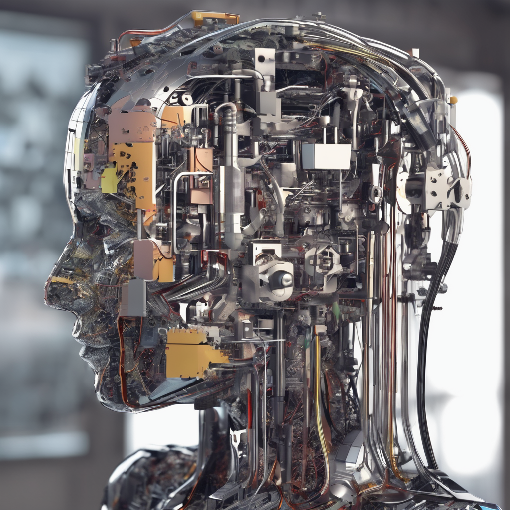
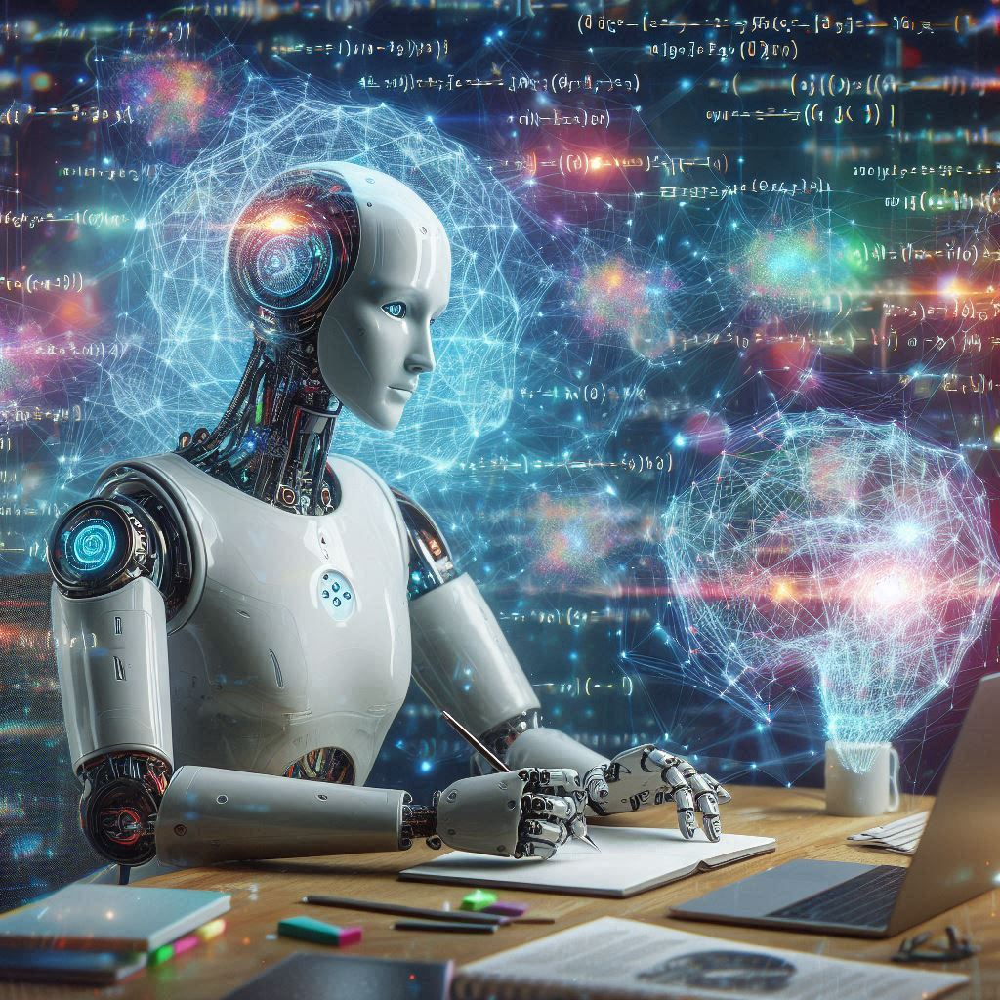
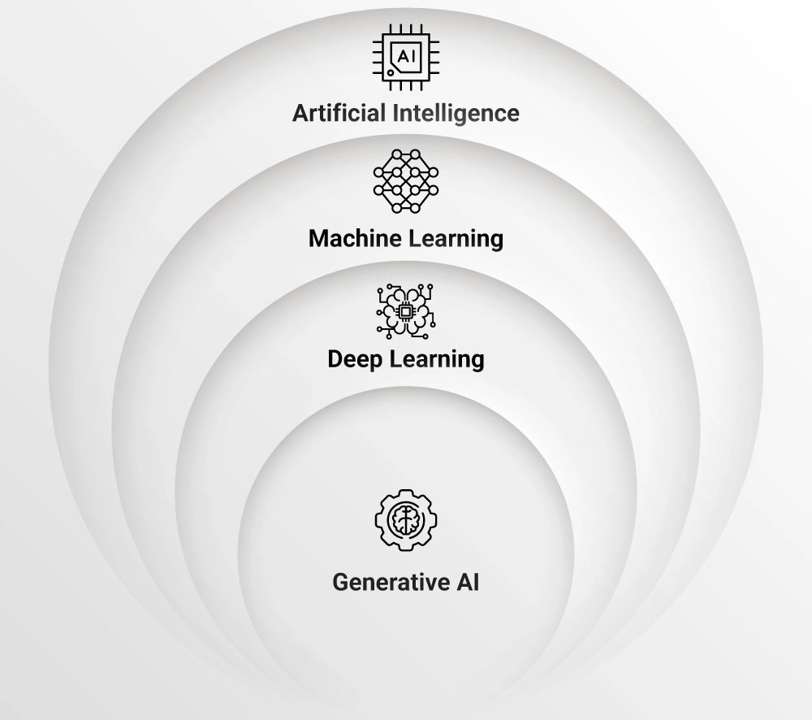

# Implementación de funciones de IA Generativa  en aplicaciones Web.

## Salvador Hernández Mendoza

### v 21.08.2024

---

# Objetivo

Conocer las bases de la IA Generativa para el consumo de modelos de lenguaje largo (LLM) tanto locales como en línea, y su implementación en aplicaciones web.

---

# Justificación

En un entorno digital cada vez más avanzado y competitivo, es esencial comprender las bases de la IA Generativa y los modelos de lenguaje largo (LLM), ya que estos representan una de las tecnologías más disruptivas y versátiles en la actualidad. 

---

# Temario

* Módulo 1: Introducción a la IA Generativa
* Módulo 2: Instalación y configuración de servidores de LLM locales
* Módulo 3: Consumo de LLM mediante API REST
* Módulo 4: Consumo de llm en la nube
* Módulo 5: Proyecto “Chat Web”

---

# Módulo 1: Introducción a la IA Generativa

* 1.1 Qué es la IA Generativa
* 1.2 Modelos de lenguaje largo LLM
* 1.3 Modelos Modales y Multimodales
* 1.4 Historia y evolución de la IA Generativa
* 1.5 Impacto y aplicaciones en diversas industrias

---

# Módulo 2: Instalación y configuración de servidores de LLM locales

* 2.1 Instalación y configuración de ollama
* 2.2 Descarga y pruebas de modelos llm locales
* 2.3 Ejecución de consultas y evaluación de respuestas generadas ¿por qué el cielo es azúl?

---

# Módulo 3: Consumo de LLM mediante API REST

* 3.1 Programación de mi primer aplicación con API REST
* 3.2 Creación de modelos personalizados
* 3.3 Autenticación y seguridad en API REST (Bearer)

---

# Módulo 4: Consumo de llm en la nube

* 4.1 Creación de cuentas en Groq y  Gemini
* 4.2 Consumo de modelos en la nube
* 4.3 Comparación entre LLM locales y en la nube
* 4.4 Pros y contras del consumo de modelos en la nube

---

# Módulo 5: Proyecto “Chat Web”

* 5.1 Diseño del sistema y desarrollo del proyecto.
* 5.2 Desarrollo de la interfaz de usuario.
* 5.3 Integración del LLM y pruebas funcionales.

---

# Conceptos

---

# Artificial Intelligence (AI)

Es el campo general que abarca todas las tecnologías que permiten a las máquinas realizar tareas que normalmente requieren inteligencia humana.

---

# Machine Learning (ML)

Es una subcategoría de AI que se enfoca en el desarrollo de algoritmos que permiten a las máquinas aprender de datos y mejorar con la experiencia.

---

# Deep Learning (DL)

Es una subcategoría de ML que utiliza redes neuronales profundas para modelar y entender patrones complejos en grandes volúmenes de datos.

---

# Generative AI

Es una aplicación específica de DL que se centra en la creación de contenido nuevo y original, como texto, imágenes, música, etc., a partir de modelos entrenados.

---

# Evolución de la IA Generativa

